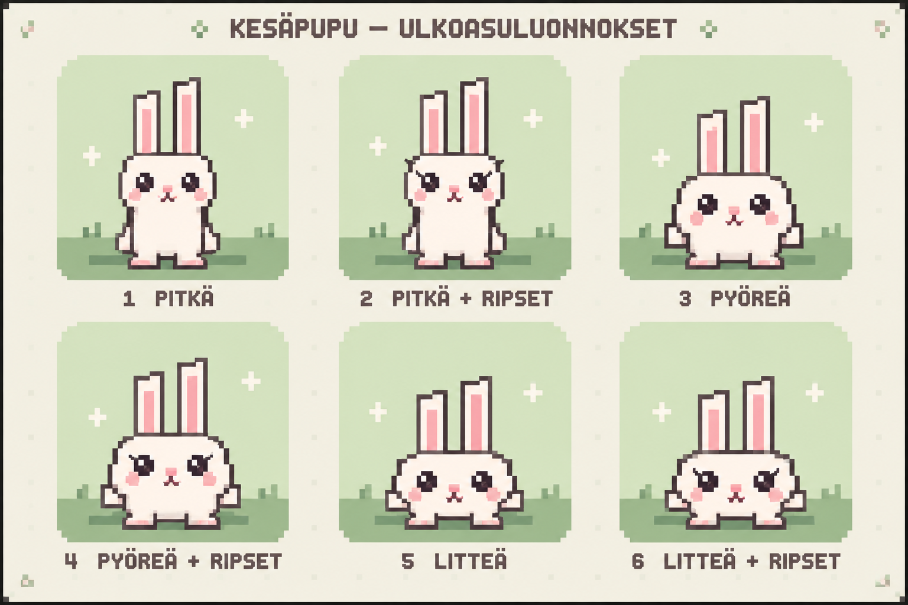
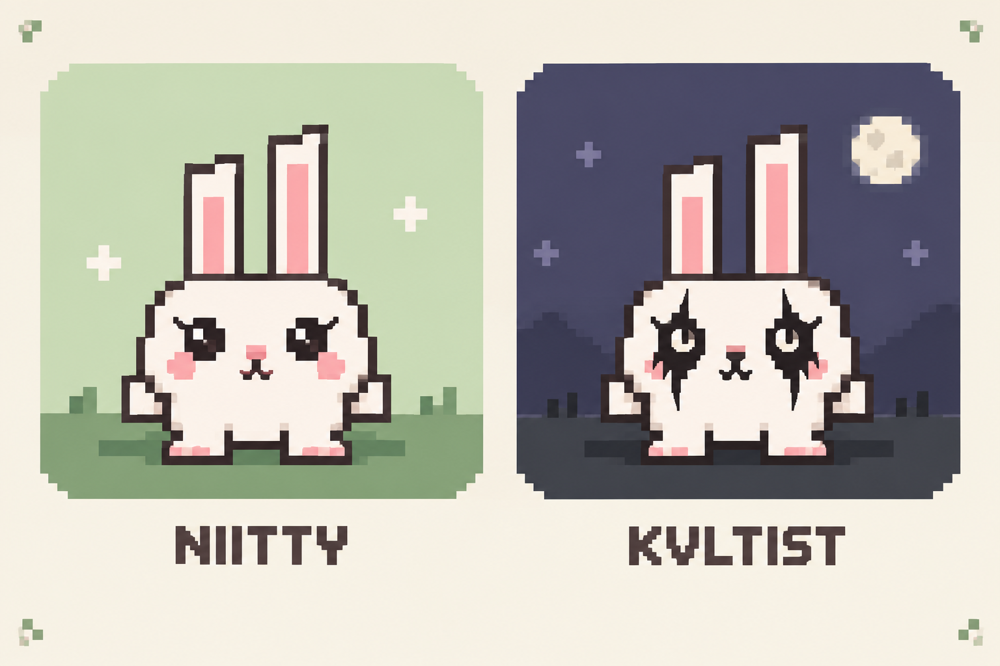
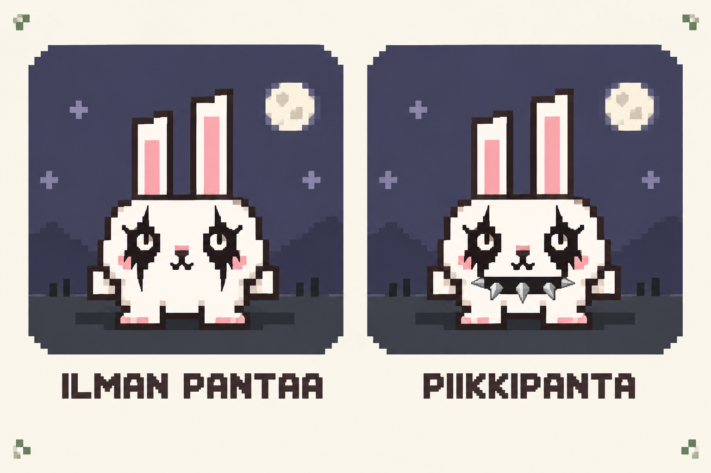

# Pupun ulkoasuluonnokset

Säilytetään myöhemmin mahdollisesti toteutettavaa hahmoasun valikkoa varten. Valikkoa ei vielä ole pelissä. Kuvat ovat imagegen-työkalulla tehtyjä konseptikuvia; pelin hahmo piirretään edelleen omalla canvas-koodilla.

## Kesäpupun vaihtoehdot

| Numero | Ulkoasu | Tila |
| --- | --- | --- |
| 1 | Pitkä | Säilytetty vaihtoehto |
| 2 | Pitkä ja ripset | Säilytetty vaihtoehto |
| 3 | Pyöreä | Säilytetty vaihtoehto |
| 4 | Pyöreä ja ripset | Valittu Niityn vakiohahmon pohjaksi |
| 5 | Litteä | Säilytetty vaihtoehto |
| 6 | Litteä ja ripset | Säilytetty vaihtoehto |

## Vakiohahmon teemat

Niityssä käytetään pyöreää pupua ripsillä. Kvltistissä ja Kvltist Winterissä käytetään samaa pyöreää muotoa, suuria silmiä ja mustaa corpse paintia. Kaulapantaa tai muita asusteita ei lisätä. Ulkoasu ei muuta hahmon törmäysmittoja, ohjausta tai hyppykorkeutta.

Aiemman pelihahmon piirto säilytetään tiedostossa `classic-bunny-reference.js` lähdekoodiviitteenä. Luonnoskuvia ja arkistoitua piirtoa ei ladata pelin ajonaikaiseen pakettiin eikä offline-välimuistiin.

## Piikkipantavaihtoehto

Piikkipanta on säilytetty luonnos myöhempää hahmoasuvalikkoa varten. Pelin vakiohahmo käyttää pannatonta corpse paint -ulkoasua.

Kuvien tuotantotapa: sisäänrakennettu imagegen. Ensimmäisen kuvan ohje oli vertailla pitkää, pyöreää ja litteää valkoista pikselipupua ripsillä ja ilman. Toisen kuvan ohje oli säilyttää valitun vaihtoehdon 4 muoto ja vertailla Niittyä sekä Kvltistin corpse paintia ilman asusteita. Kolmas kuva vertaa samaa Kvltist-pupua ilman pantaa ja mustalla pannalla, jossa on lyhyet metalliset piikit.
